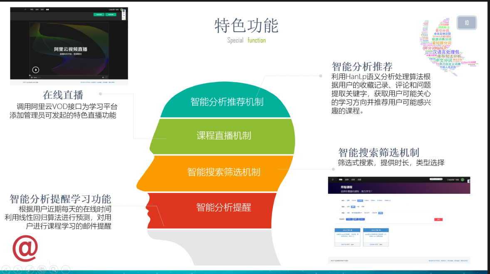
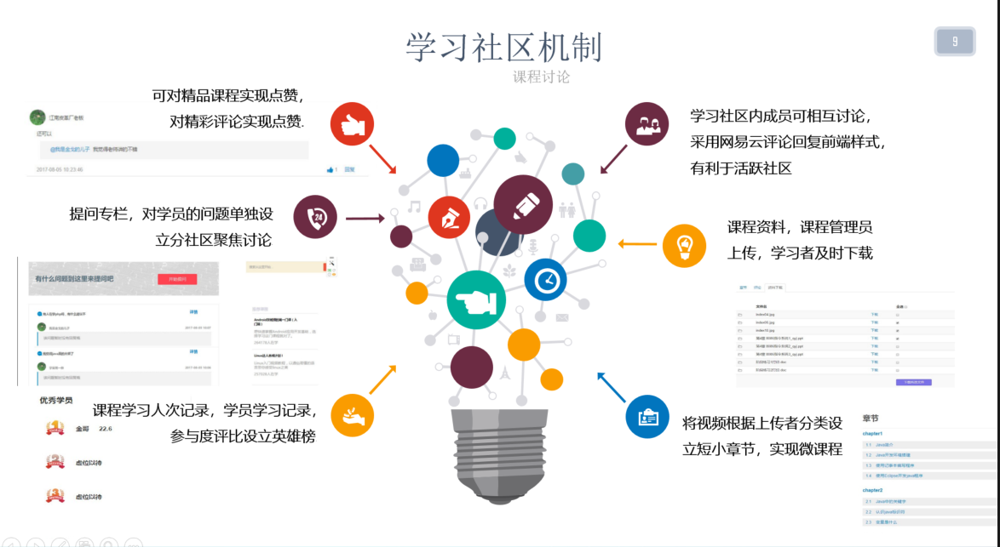
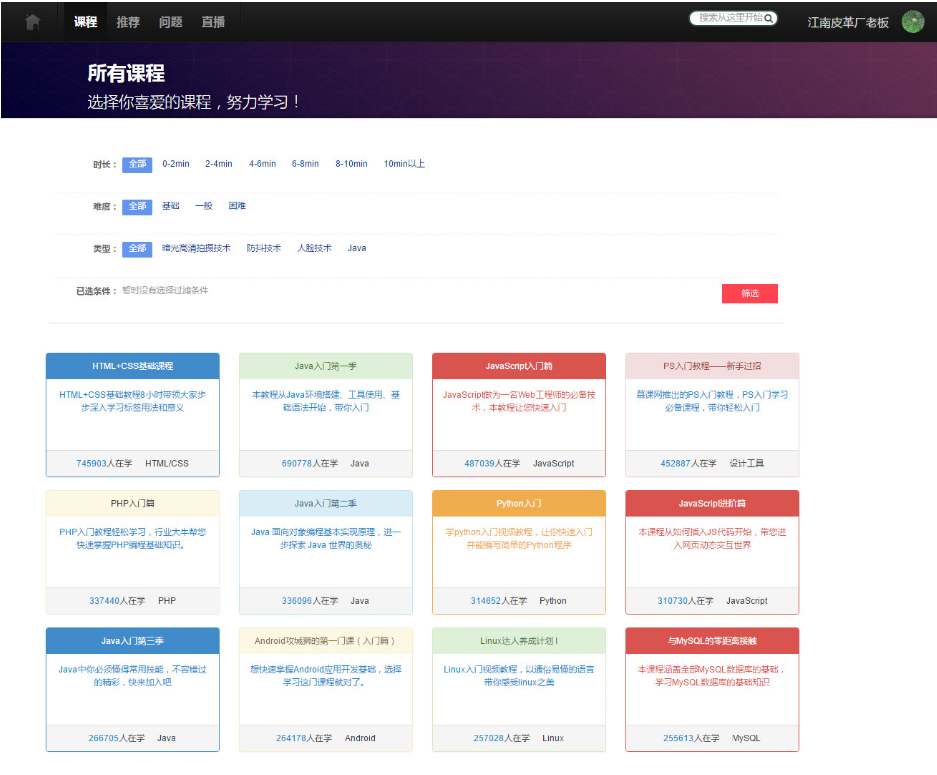
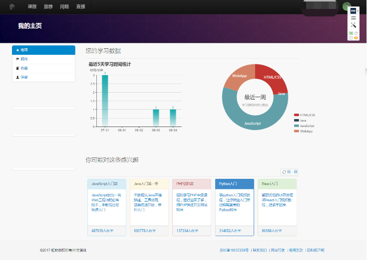
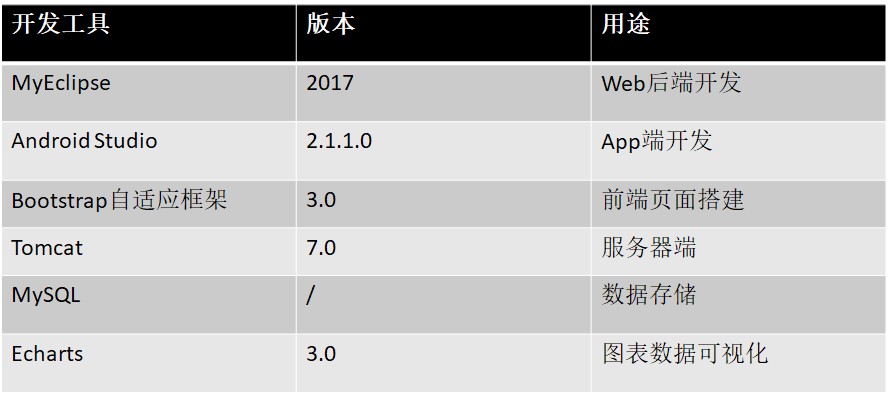
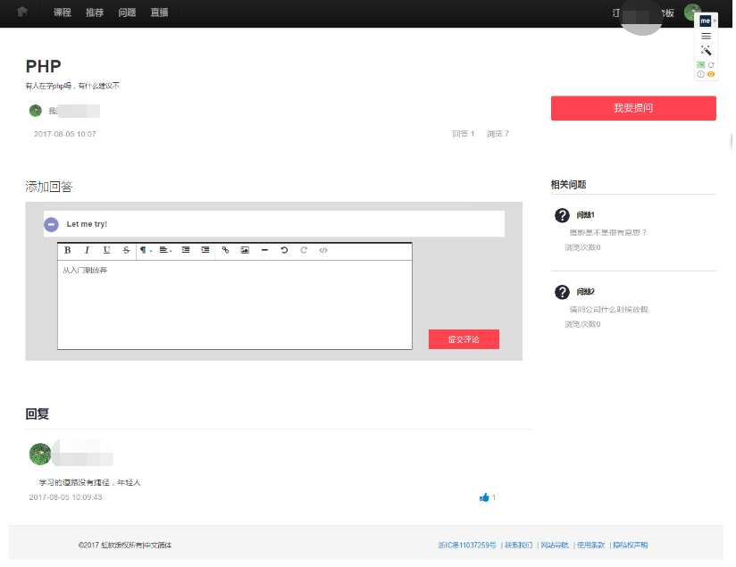
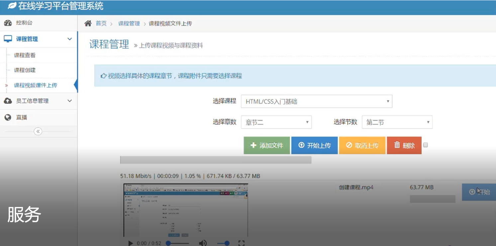

# OnlineLearningPlatform
## 在线学习平台

### 用户与管理员模式分离

### 学习数据分析及预测推荐
采用机器学习回归算法实现学习时间预测，使用邮件对学员进行学习提醒；对数据进行分析，采用Echarts3.0技术对学习数据分析结果进行可视化

### 资料上传及信息录入
视频开发分为Web端与App端，Web端采用video.js进行开发，APP端采用缓存机制
课程

资料上传采用H5文件拖拽上传，信息录入采用EXCEL表格导入信息

### Pc与手机端并行学习
### 学习社区

### 资料与信息导入 支持EXCEL表格信息导入

### 满⾜多⼈同时在线使⽤和查看⽽没有明显的卡顿。
